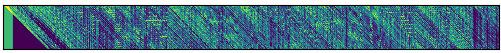
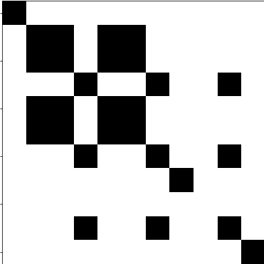

# SELF SIMILARITY MATRICES





## Introduction
Self Similarity and Self Similarity Lag Matrices (SSMs and SSLMs) are representations of similar sequences in music and 
they are commonly used in 
[Music Structure Segmentation](https://github.com/carlosholivan/MusicStructureAnalysis) MIREX task.

In this repository, we show how these input matrices are obtained following previous works methods. 
The code has been programmed in the University of Zaragoza, in the Department of Electronic Engineering and Communications 
by Carlos Hernández, David Díaz-Guerra and José Ramón Beltrán.

## Repository Organization

The actual files in the repository are divided jupyter notebooks:

| Notebook name | Description | Paper Title | Paper | Paper Authors | Year | Journal/Conference |
| --- | --- | --- | --- | --- | --- | --- |
| [SelfSimilarityLagMatrix-Grill_Schluter](https://github.com/carlosholivan/SelfSimilarityMatrices/blob/master/notebooks/SelfSimilarityLagMatrix-Grill_Schluter.ipynb) | SSLM calculated from MFCCs and cosine distance | "Music Boundary Detection using Neural Networks on Spectrograms and Self-Similarity Lag Matrices" | [PDF](http://www.ofai.at/~jan.schlueter/pubs/2015_eusipco.pdf) | T. Grill and J. Schlüter | 2015 | EUPSICO |
| [SelfSimilarityMatrix_Serra](https://github.com/carlosholivan/SelfSimilarityMatrices/blob/master/notebooks/SelfSimilarityMatrix_Serra.ipynb) | Recurrence plot and SSM calculated from MFCCs | "Unsupervised Music Structure Annotation by Time Series Structure Features and Segment Similarity" | [PDF](https://ieeexplore.ieee.org/abstract/document/6763101/) | J. Serrà, M. Müller, P. Grosche, J. Ll. Arcos | 2014 | IEEE |


## Prerequisites

Python 3.5 or later. In Ubuntu, Mint and Debian Python 3 can be installed like this:

```
sudo apt-get install python3 python3-pip
```

[Librosa 0.7.2](https://librosa.github.io/librosa/install.html)

```
sudo pip install librosa
```

If you use conda/Anaconda environments, librosa can be installed from the conda-forge channel:

```
conda install -c conda-forge librosa
```

## Webs of Interest

[MIREX](https://www.music-ir.org/mirex/wiki/MIREX_HOME) 

[MIR](https://musicinformationretrieval.com/)

## Authors

* [**Carlos Hernández**](https://carlosholivan.github.io/index.html) - carloshero@unizar.es
* **David Díaz-Guerra** - ddga@uniza.es
* **José Ramón Beltrán** - jrbelbla@unizar.es

